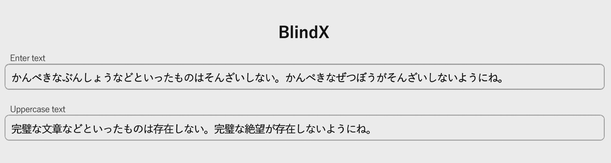

# BlindX

    

## 概要

### 日本語変換コア

BlindX は Transformer T5 (Text-to-Text Transfer Transformer) をベースにした推論機能を用いたな日本語処理
フロントエンドです。AI機能のもつ柔軟な日本語生成機能をもちながら、人間との最初のインターフェースとして素早く快適な応答を実現します。推論は GPU を使用した専用のサーバを介して行われます。
その結果を用いて使用のバリアの低い UI をもつエッジクライアントを構築できることを目指します。

### サーバとの通信

BlindX サーバの自体は単純な websocket による非同期 echo サーバです。最も基本的な通信ではクライアントがひらがな文を送信すると
対応するかな漢字文が返信されます。

websockets echo

サーバでの変換はスレッドごとにひとつの send() に対して対応するひとつの recv() で完結し、ステートレスで行われます。
すなわちサーバ側はクライアントの送信した以前の状態は保持しません。従って変換にあたっては辞書の指定および必要な前後の文脈や文章も含めてその都度再送信されることになります。

### 辞書の選択

変換にあたっては異なるコーパス（語彙のデータベース）から学習させた複数の辞書から適切なものが選択されます。
辞書の一例

この辞書は個人ごとではなく、ドメインごとの語彙集合が時代とともに推移していくの合わせに更新されます。
辞書の選択は多くの場合アプリケーションの特性に応じて選ばれます。

## 変換の実際

### プリプロセッサ

Blindx は字句解析前の日本語ひらがなを入力とします。しかしユーザから見るとひらがな入力自体が最前列
のインターフェースではなく、実際の入力手段はモーダル（使用形態）によって異なります
そこで BlindX ではモーダルごとに別個にプリプロセッサが置かれます。
場合によってはその後段にモーダル特有の軽微な誤入力を修正するフィルタが挿入されます。
デスクトップアプリではキーボードのローマ字入力をひらがな文字列に変換する部分がこれにあたります。

blindX のローマ字変換
blindX のデフォルトのローマ字ひらがなパーサはいくつか拡張がされています。多くは既存の IME との相互運用を
容易にするためのものです。

半角英数字も一旦全角英数字に変換されます
2025ねん1がつ１にち

２０２５ねん１がつ１にち

はじめからかな漢字のものはひらがなのまま出力されます

ashitanotenkiは晴れdatoomou

あしたのてんきは晴れだとおもう

'`' (バッククォート）された範囲は半角ローマ字のまま出力されます。

Hey Jude habi-toruzunogakkyokudesu

Hey Jude はびーとるずのがっきょくです

#### 変換のレイテンシ（遅延）

#### 並列の変換

#### 文脈をみた変換

#### 修正

#### 校正

#### さらに広範囲な校正（オプション）

## いくつかの実施例

### Webアプリとデスクトップアプリ

## Compare

   <video src="./screenshots/scompare2.mp4" controls="true" width="640"></video>

ソースコードはこちらを参照ください

## Real-time Chat

   <video src="./screenshots/schat2.mp4" controls="true" width="480"></video>

ソースコードはこちらを参照ください

非同期なリアルタイムチャット

## On-line Edit

   <video src="./screenshots/report4.mp4" controls="true" width="640"></video>

コードはこちら

